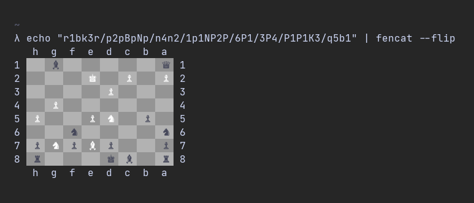

# fencat

Display FEN chess notation strings in your terminal.

Usage: fencat (--flip) FILE

* Example: echo rnbqkbnr/pppppppp/8/8/8/8/PPPPPPPP/RNBQKBNR | fencat
* Example: fencat fen.txt
* Example: fencat < fen.txt

Currently only shows the board. Other FEN data will be displayed soon.

## Compiling

Just run `cargo build -r` to compile on your platform.
